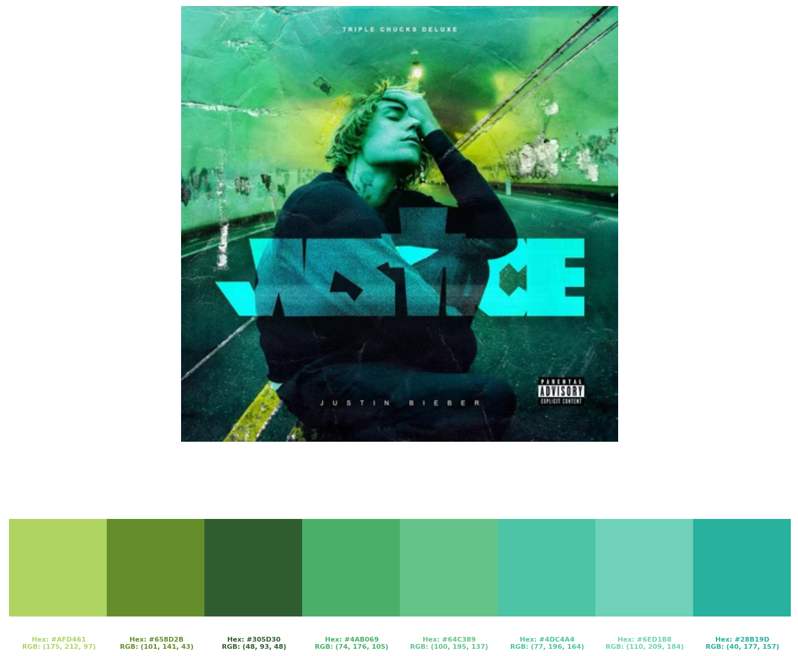
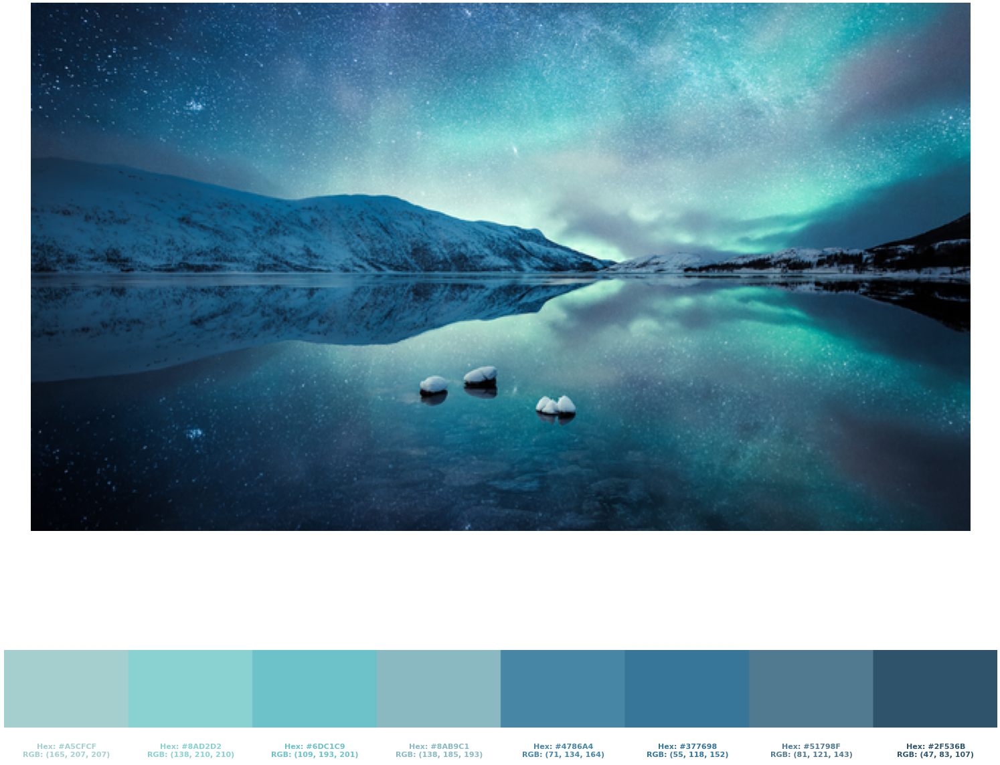

# Color Extractor
A simple python script to extract the most common colors from an image.

## Requirements
- Python 3
- Numpy
- Matplotlib
- sklearn
- colorsys
- pillow
- yaml

## Installation
```bash
git clone https://github.com/XinChen-stars/Color_Extractor.git
```

## Usage
```bash
python3 color_extractor.py 
```

## Configuration
Settings of the image can be modified in `color_extraction.py`. Important settings are:
- `image_folder` - image source folder
- `image_name` - image name with extension
- `color_folder` - color output folder
- `yaml_name` - color output yaml file name
- `num_colors` - number of colors to extract
- `resize_factor` - resize factor of the image,avoiding large images

## Example
<div align="center">
  
  
  
  
  
</div>
